# ОТЧЁТ

## Как запустить?
 
Для начала установите Postgresql 18. В pgAdmin 4 создайте новую базу данных `library`. Откройте `query tool` и запустите sql файлы от task1 до task4. Теперь запустите консольное приложение `uv run main.py`. Логин и пароль прописаны в `task3.sql`.

## «Библиотечная информационная система»

> 1. Спроектировать и заполнить реляционную базу данных с минимум 5-ю связными таблицами, используя первичные и внешние ключи для библиотечной информационной системы. На выбор можно использовать любую реляционную СУБД, кроме SQLite.

В ходе выполнения работы была спроектирована и реализована реляционная база данных для библиотечной информационной системы с использованием системы управления базами данных PostgreSQL. Разработка и тестирование выполнялись в графической среде pgAdmin 4.

На первом этапе была создана отдельная схема базы данных с именем library, что позволило логически изолировать все объекты системы. Внутри данной схемы была разработана структура базы данных, включающая шесть взаимосвязанных таблиц: авторы, жанры, книги, связь книг и жанров, читатели и выдачи книг. Такая структура отражает предметную область и позволяет хранить информацию о книгах, их авторах, жанрах, а также учитывать процесс выдачи литературы читателям.

Таблица авторов содержит уникальные идентификаторы и имена авторов. Таблица жанров аналогично хранит список жанров. Основной таблицей является таблица книг, в которой каждая запись связана с автором через внешний ключ. Для реализации связи «многие ко многим» между книгами и жанрами была создана промежуточная таблица. Таблица читателей содержит информацию о пользователях библиотеки, включая уникальный адрес электронной почты. Таблица выдач фиксирует факты получения книг читателями и содержит даты выдачи и возврата.

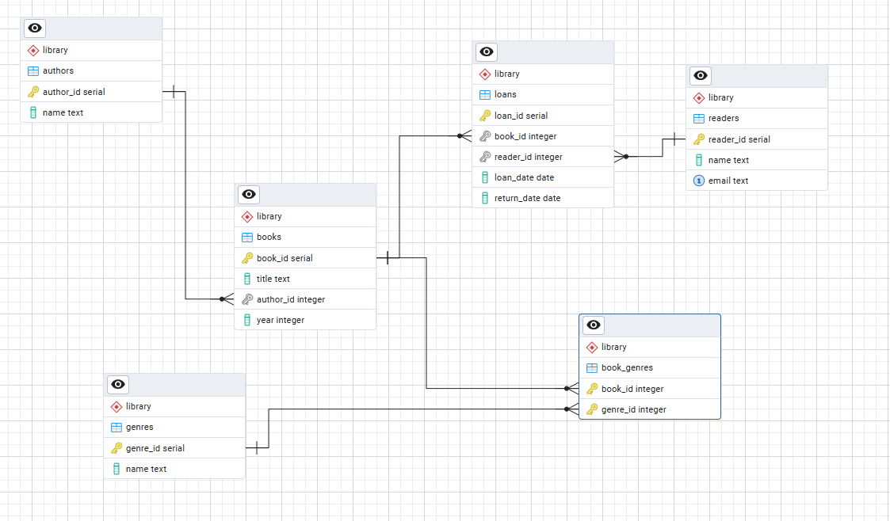

После создания структуры базы данных было выполнено её заполнение тестовыми данными. Были добавлены записи об авторах, жанрах, книгах и читателях, а также установлены связи между книгами и жанрами. Заполнение выполнялось в корректной последовательности, обеспечивающей соблюдение ограничений внешних ключей.

```sql
INSERT INTO authors (name) VALUES
('Лев Толстой'),
('Фёдор Достоевский');

INSERT INTO genres (name) VALUES
('Роман'),
('Драма');

INSERT INTO books (title, author_id, year) VALUES
('Война и мир', 1, 1869),
('Преступление и наказание', 2, 1866);

INSERT INTO book_genres VALUES
(1, 1),
(2, 1);

INSERT INTO readers (name, email) VALUES
('Иван Иванов', 'ivan@mail.com'),
('Анна Петрова', 'annap@mail.com');
```

Следующим этапом стала реализация механизма доступа к данным исключительно через хранимые процедуры. Это требование было выполнено путём создания набора процедур на языке PL/pgSQL. Были реализованы процедуры добавления книги, добавления читателя, выдачи книги и возврата книги. Каждая из процедур инкапсулирует соответствующую SQL-операцию и позволяет работать с данными без прямого обращения к таблицам.

Процедура добавления книги принимает название, идентификатор автора и год издания, после чего выполняет вставку новой записи в таблицу книг. Процедура добавления читателя добавляет нового пользователя в систему. Процедура выдачи книги фиксирует факт передачи книги читателю с текущей датой. Процедура возврата книги обновляет запись о выдаче, устанавливая дату возврата.

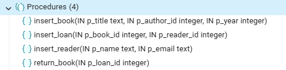

После создания процедур было проведено тестирование их работы. В процессе тестирования выполнялись вызовы процедур с различными параметрами. Были успешно добавлены новые записи в таблицы, а также выполнены операции выдачи и возврата книги. Результаты тестирования подтвердили корректность работы реализованной логики.

```sql
CALL insert_book('Family', 2, 1869);
CALL insert_reader('Петр Сидоров', 'petrs@mail.com');
CALL insert_loan(1, 1);
CALL return_book(1);
```

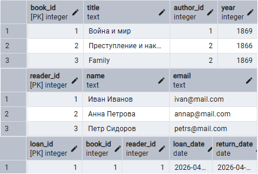

>2. Подготовить хранимые процедуры для работы с таблицами через передаваемые аргументы: 
>    1. SELECT процедуры для поиска по значению 
>    2. UPDATE процедуры для обновления 
>    3. INSERT для добавления новых строк в таблицу 
>    4. DELETE для удаления строк

Следующим этапом разработки стало создание расширенного набора хранимых процедур, обеспечивающих полный набор операций работы с данными: выборку, добавление, обновление и удаление записей. Все процедуры реализованы на языке PL/pgSQL и принимают параметры, что позволяет гибко управлять данными без прямого обращения к таблицам.

Для выполнения операций выборки были разработаны процедуры поиска. В частности, реализована процедура поиска книг по названию, которая использует оператор ILIKE для частичного совпадения строки, что делает поиск нечувствительным к регистру и удобным для пользователя. Результат возвращается через курсор, что соответствует особенностям работы процедур в PostgreSQL. Аналогично реализована процедура поиска читателя по адресу электронной почты, позволяющая быстро находить конкретного пользователя системы.

```sql
BEGIN;
CALL find_books_by_title('война', 'mycursor');
FETCH ALL FROM mycursor;
COMMIT; -- Таблица будет видна без этой строки
```

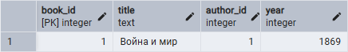

Операции добавления данных реализованы через отдельный набор процедур для каждой сущности системы. Были созданы процедуры для добавления авторов, жанров, книг, читателей, а также для формирования связей между книгами и жанрами. Такой подход обеспечивает модульность и повторное использование кода. Особое внимание было уделено процедуре выдачи книги, которая помимо вставки данных реализует проверку бизнес-логики.

В процедуре выдачи книги выполняется несколько проверок: наличие книги в базе данных, существование читателя, а также проверка того, что книга не выдана другому читателю на текущий момент. В случае нарушения одного из условий генерируется исключение, предотвращающее некорректное изменение данных. Это позволяет обеспечить целостность и корректность бизнес-процессов системы.

```sql
CREATE OR REPLACE PROCEDURE insert_loan(
    p_book_id INT,
    p_reader_id INT
)
LANGUAGE plpgsql
AS $$
BEGIN
    -- Проверка существования книги
    IF NOT EXISTS (
        SELECT 1 FROM books WHERE book_id = p_book_id
    ) THEN
        RAISE EXCEPTION 'Книга с ID % не существует', p_book_id;
    END IF;

    -- Проверка существования читателя
    IF NOT EXISTS (
        SELECT 1 FROM readers WHERE reader_id = p_reader_id
    ) THEN
        RAISE EXCEPTION 'Читатель с ID % не существует', p_reader_id;
    END IF;

    -- Проверка: книга уже выдана?
    IF EXISTS (
        SELECT 1 FROM loans 
        WHERE book_id = p_book_id AND return_date IS NULL
    ) THEN
        RAISE EXCEPTION 'Книга уже выдана и не возвращена';
    END IF;

    -- Если всё ок → выдаём
    INSERT INTO loans(book_id, reader_id, loan_date)
    VALUES (p_book_id, p_reader_id, CURRENT_DATE);
END;
$$;
```
```sql
CALL insert_loan(2, 2);
```

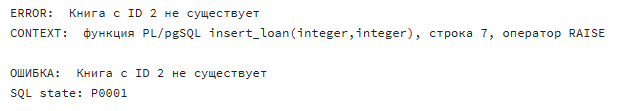

Для обновления данных были реализованы процедуры изменения информации о книгах и читателях. Процедура обновления книги позволяет изменить название и год издания по идентификатору, а процедура обновления читателя — изменить адрес электронной почты. Обновление выполняется строго по заданному идентификатору, что исключает случайные изменения других записей.

```sql
CREATE OR REPLACE PROCEDURE update_book(
    IN p_book_id INT,
    IN p_title TEXT,
    IN p_year INT
)
LANGUAGE plpgsql
AS $$
BEGIN
    UPDATE books
    SET title = p_title,
        year = p_year
    WHERE book_id = p_book_id;
END;
$$;
```
```sql
CALL update_book(1, 'Война и мир (ред.)', 1870);
```
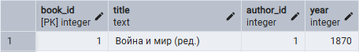

Удаление данных также реализовано через хранимые процедуры с учётом связей между таблицами. Например, при удалении книги сначала удаляются все связанные записи из таблицы связей с жанрами, после чего удаляется сама книга. Аналогично при удалении читателя сначала удаляются записи о выданных книгах, а затем сам читатель. Такой порядок действий предотвращает нарушение ограничений внешних ключей.

```sql
CREATE OR REPLACE PROCEDURE delete_book(p_book_id INT)
SECURITY DEFINER
AS $$
BEGIN
    -- сначала удаляем связи
    DELETE FROM book_genres
    WHERE book_id = p_book_id;
    -- потом все выданные книги
    DELETE FROM loans
    WHERE book_id = p_book_id;
    -- потом саму книгу
    DELETE FROM books
    WHERE book_id = p_book_id;
END;
$$ LANGUAGE plpgsql;
```

```sql
CREATE OR REPLACE PROCEDURE delete_reader(p_reader_id INT)
AS $$
BEGIN
    DELETE FROM loans WHERE reader_id = p_reader_id;
    DELETE FROM readers WHERE reader_id = p_reader_id;
END;
$$ LANGUAGE plpgsql;
```

После реализации всех процедур было проведено комплексное тестирование системы. Тестирование включало выполнение операций поиска, добавления, обновления и удаления данных. Также была выполнена массовая загрузка тестовых данных, включающая добавление авторов, жанров, книг, читателей и операций выдачи книг. Все операции выполнялись исключительно через процедуры, что полностью соответствует требованиям задания.

```sql
-- SELECT
BEGIN;
CALL find_books_by_title('война', 'mycursor');
FETCH ALL FROM mycursor;
COMMIT;
-- INSERT
CALL insert_book('Братья Карамазовы', 2, 1880);
-- UPDATE
CALL update_book(1, 'Война и мир (ред.)', 1870);
-- DELETE
CALL delete_book(2);
```

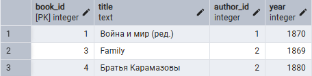

В ходе тестирования была проверена работа курсоров при выполнении SELECT-запросов через процедуры. Результаты успешно извлекались с использованием команд BEGIN, CALL, FETCH и COMMIT, что подтвердило корректность реализации механизма возврата данных.

```sql
-- Добавление авторов
CALL insert_author('Лев Толстой');
CALL insert_author('Фёдор Достоевский');
CALL insert_author('Александр Пушкин');
CALL insert_author('Антон Чехов');
...
-- Добавление жанров
CALL insert_genre('Роман');
CALL insert_genre('Драма');
CALL insert_genre('Поэзия');
...
-- Добавление книг
CALL insert_book('Война и мир', 1, 1869);
CALL insert_book('Анна Каренина', 1, 1877);
CALL insert_book('Преступление и наказание', 2, 1866);
...
-- Добавление связи книги и жанра
CALL insert_book_genre(3, 1);
CALL insert_book_genre(4, 7);
CALL insert_book_genre(5, 3);
...
-- Добавление читателей
CALL insert_reader('Иван Иванов', 'ivan1@mail.com');
CALL insert_reader('Петр Петров', 'petr@mail.com');
CALL insert_reader('Анна Смирнова', 'anna@mail.com');
...
-- Выдача книг читателям
CALL insert_loan(1, 1);
CALL insert_loan(4, 4);
CALL insert_loan(5, 5);
...
```

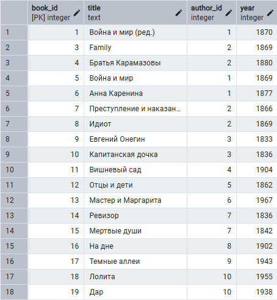

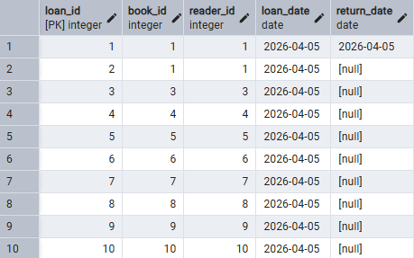

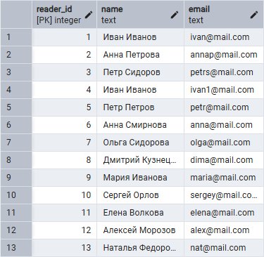

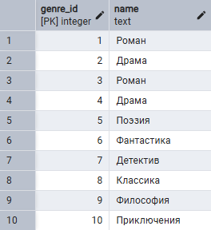

>3. Создать минимум 3 учётных записи в базе данных, настроить им доступы к необходимым процедурам и продемонстрировать их выполнение/невыполнение по уровню доступа: 
>    1. Администратор — имеет права использовать все хранимые процедуры, 
>    2. Сервисная учётная запись — имеет права на хранимые процедуры, которые использую SELECT, UPDATE и INSERT 
>    3. Пользователь — имеет права только на хранимые процедуры, использующие SELECT


Первая роль — администратор — предназначена для полного управления системой. Пользователь с данной ролью имеет доступ ко всем хранимым процедурам без ограничений. Вторая роль — сервисная учетная запись — моделирует работу серверной части приложения и имеет доступ к операциям чтения, добавления и обновления данных. Третья роль — обычный пользователь — обладает минимальными правами и может выполнять только операции выборки данных.

После создания ролей им был предоставлен доступ к использованию схемы library, что позволяет работать с объектами внутри неё. Далее была реализована ключевая мера безопасности — запрет выполнения всех хранимых процедур для роли PUBLIC. Это гарантирует, что ни один пользователь по умолчанию не сможет вызывать процедуры без явного назначения прав.

```sql
REVOKE EXECUTE ON ALL PROCEDURES IN SCHEMA library FROM PUBLIC;
```

После этого были явно назначены права выполнения процедур для каждой роли. Администратору был выдан доступ ко всем процедурам схемы без исключения. Для сервисной учетной записи доступ был предоставлен выборочно: только к процедурам, реализующим операции SELECT, INSERT и UPDATE. При этом важно отметить, что при выдаче прав учитывались сигнатуры процедур, включая типы и порядок параметров, что является обязательным требованием в PostgreSQL.

```sql
GRANT EXECUTE ON ALL PROCEDURES IN SCHEMA library TO admin;
```

Обычному пользователю были предоставлены права исключительно на выполнение процедур выборки, возвращающих данные через курсор. Это позволяет пользователю получать информацию из системы, не имея возможности её изменять.

```sql
-- SELECT процедуры
GRANT EXECUTE ON PROCEDURE find_books_by_title(TEXT, INOUT REFCURSOR) TO service;
GRANT EXECUTE ON PROCEDURE find_reader_by_email(TEXT, INOUT REFCURSOR) TO service;

-- INSERT процедуры
GRANT EXECUTE ON PROCEDURE insert_book(TEXT,INT,INT) TO service;
GRANT EXECUTE ON PROCEDURE insert_reader(TEXT,TEXT) TO service;
GRANT EXECUTE ON PROCEDURE insert_author(TEXT) TO service;
GRANT EXECUTE ON PROCEDURE insert_genre(TEXT) TO service;
GRANT EXECUTE ON PROCEDURE insert_book_genre(INT,INT) TO service;
GRANT EXECUTE ON PROCEDURE insert_loan(INT,INT) TO service;

-- UPDATE процедуры
GRANT EXECUTE ON PROCEDURE update_book(INT,TEXT,INT) TO service;
GRANT EXECUTE ON PROCEDURE update_reader_email(INT,TEXT) TO service;

-- SELECT процедуры для пользователя
GRANT EXECUTE ON PROCEDURE find_books_by_title(TEXT, INOUT REFCURSOR) TO app_user;
GRANT EXECUTE ON PROCEDURE find_reader_by_email(TEXT, INOUT REFCURSOR) TO app_user;
```

После настройки прав доступа была проведена их практическая проверка с использованием команды смены роли (SET ROLE), позволяющей эмулировать выполнение операций от имени разных пользователей.

При работе под ролью администратора были успешно выполнены все операции: добавление новой книги, обновление существующей записи, удаление книги, а также выполнение поиска с использованием курсора. Это подтверждает наличие полного доступа ко всем процедурам системы.

При переключении на сервисную учетную запись было установлено, что операции добавления, обновления и выборки данных выполняются корректно. В частности, успешно выполнялись процедуры вставки книги, изменения данных и поиска с использованием курсора. Однако при попытке вызова процедуры удаления была получена ошибка, связанная с отсутствием прав доступа. Это подтверждает корректную настройку ограничений.

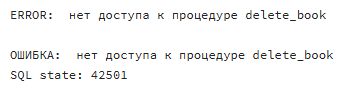

При работе от имени обычного пользователя была подтверждена возможность выполнения только операций выборки данных. Пользователь успешно выполнял процедуру поиска книг, получая результат через курсор. Попытки выполнения процедур добавления, обновления и удаления приводили к ошибкам доступа, что полностью соответствует заданной модели безопасности.

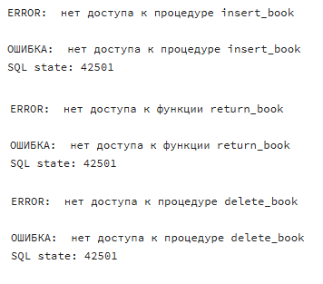

>4.	*Создать лог-таблицы и лог-триггеры — таблицы, которые дублируют спроектированные таблицы с окончанием «_log», которые пополняются данными через созданные триггеры на каждую таблицу. 
>    Триггеры срабатывают на INSERT, UPDATE, DELETE. Дополнительные столбцы в лог-таблицах:
>    1.	user_name – имя пользователя, который вызвал действие
>    2.	update_time – дата-время действия
>    3.	action – наименование действия, из-за которого пишется запись в таблицу

Для каждой основной таблицы базы данных была создана соответствующая лог-таблица с тем же набором полей, дополненным служебной информацией. В частности, в каждую лог-таблицу были добавлены три дополнительных столбца: имя пользователя, выполнившего операцию, дата и время изменения, а также тип выполненного действия. Таким образом, каждая запись в логе содержит не только данные, но и контекст их изменения.

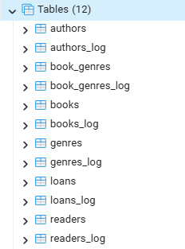

Далее были разработаны функции триггеров для каждой таблицы. Эти функции реализованы на языке PL/pgSQL и выполняются при наступлении событий INSERT, UPDATE и DELETE. В зависимости от типа операции функция определяет, какие данные необходимо записать в лог: для операций вставки и обновления используются новые значения (NEW), а для удаления — старые значения (OLD).

Особенностью реализации является использование параметра session_user, который позволяет определить, от имени какого пользователя было выполнено действие. Это особенно важно в условиях разграничения доступа, реализованного на предыдущем этапе. Также для фиксации времени используется функция NOW(), обеспечивающая точную временную метку операции.

```sql
-- AUTHORS
CREATE OR REPLACE FUNCTION authors_log()
RETURNS TRIGGER
LANGUAGE plpgsql
SECURITY DEFINER
AS $$
BEGIN
    IF TG_OP = 'INSERT' THEN
        INSERT INTO authors_log
        VALUES (NEW.author_id, NEW.name, session_user, NOW(), 'INSERT');
        RETURN NEW;

    ELSIF TG_OP = 'UPDATE' THEN
        INSERT INTO authors_log
        VALUES (NEW.author_id, NEW.name, session_user, NOW(), 'UPDATE');
        RETURN NEW;

    ELSIF TG_OP = 'DELETE' THEN
        INSERT INTO authors_log
        VALUES (OLD.author_id, OLD.name, session_user, NOW(), 'DELETE');
        RETURN OLD;
    END IF;
END;
$$;
```

После создания функций были настроены триггеры для каждой таблицы. Триггеры настроены на срабатывание после выполнения операций INSERT, UPDATE и DELETE для каждой строки. Это означает, что каждая операция изменения данных автоматически фиксируется в соответствующей лог-таблице без участия пользователя или дополнительного кода на уровне приложения.

```sql
CREATE TRIGGER authors_log_trigger
AFTER INSERT OR UPDATE OR DELETE ON authors
FOR EACH ROW EXECUTE FUNCTION authors_log();
```

Дополнительно были реализованы хранимые процедуры для просмотра содержимого лог-таблиц. Это было сделано в соответствии с общим требованием работы — доступ к данным должен осуществляться исключительно через процедуры. Каждая процедура открывает курсор и возвращает содержимое соответствующей лог-таблицы.

```sql
CREATE OR REPLACE PROCEDURE get_authors_log(INOUT ref refcursor)
LANGUAGE plpgsql
SECURITY DEFINER
AS $$
BEGIN
    OPEN ref FOR SELECT * FROM authors_log;
END;
$$;
```

После реализации логирования было проведено тестирование работы триггеров. Для этого были выполнены операции добавления, изменения и удаления данных через ранее созданные процедуры. В частности, был добавлен новый автор, и удалён читатель. После этого были вызваны процедуры просмотра логов, которые показали, что все действия корректно зафиксированы.

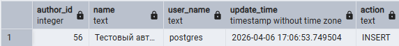

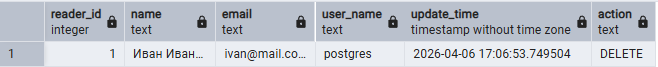

>5.	**Написать консольное приложение, использующее хранимые процедуры для работы с данными из базы данных. В зависимости от переданных логин-пароля от базы данных приложение должно корректно отрабатывать результаты хранимых процедур. Использовать ORM запрещено.

В ходе выполнения лабораторной работы было разработано консольное приложение на Python для работы с базой данных библиотеки через хранимые процедуры PostgreSQL. Приложение обеспечивает выполнение операций добавления, обновления, удаления и выборки данных в зависимости от прав пользователя, определяемых логином и паролем при подключении. Подключение реализовано через библиотеку psycopg2 с использованием ввода учетных данных из консоли и включенным автокоммитом, что обеспечивает корректное выполнение транзакций без необходимости явного подтверждения изменений.

Для выборки данных использованы процедуры с курсором типа REFCURSOR, позволяющие получать результаты поиска книг по названию и читателей по email. При этом корректно обрабатываются пустые результаты и ошибки доступа. Операции вставки, обновления и удаления данных также выполняются исключительно через вызовы процедур, с проверкой типов и обработкой возможных исключений.

Особое внимание было уделено разграничению прав доступа. В PostgreSQL были созданы три роли: администратор с полным доступом ко всем процедурам, сервисная учетная запись, имеющая права на выборку, добавление и обновление данных, и обычный пользователь с ограничением только на выполнение процедур выборки. Для роли PUBLIC был запрещен вызов всех процедур, что предотвращает несанкционированное использование системы. Права на выполнение процедур каждой роли были назначены с учетом сигнатур процедур, включая типы и порядок параметров.

Работа приложения проверялась практическим использованием различных учетных записей. Под ролью администратора успешно выполнялись все операции, включая добавление новых книг и авторов, изменение данных, удаление записей и выборку с использованием курсора. Сервисная учетная запись корректно выполняла операции выборки, вставки и обновления, при попытке вызова процедуры удаления возникала ошибка доступа, что подтверждает правильность настройки ограничений. Обычный пользователь имел возможность только выполнять поиск и получать данные через курсор; все попытки изменения или удаления данных приводили к отказу в доступе.

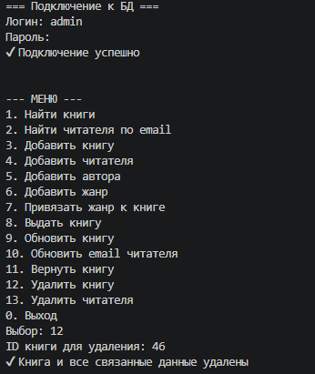

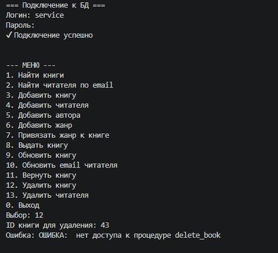

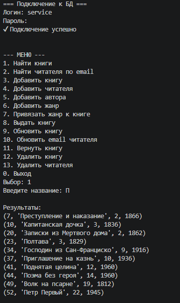

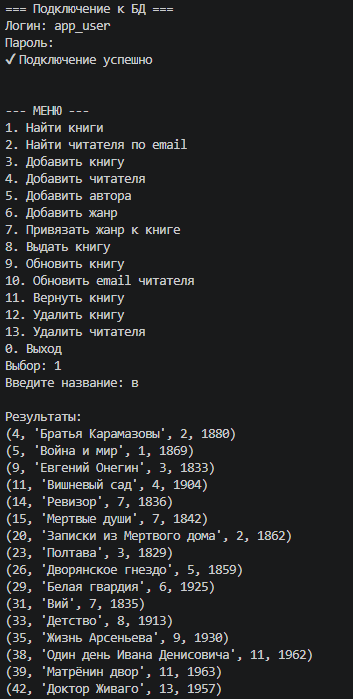

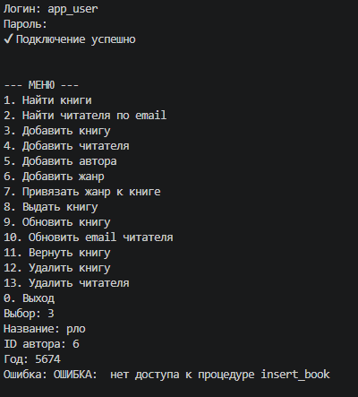

Таким образом, в ходе работы была построена безопасная архитектура взаимодействия с базой данных, в которой все операции с информацией происходят исключительно через хранимые процедуры, а прямой доступ к таблицам полностью исключен. Консольное приложение корректно обрабатывает права пользователей, демонстрируя строгое разграничение доступа и предотвращая несанкционированные изменения данных, что соответствует промышленным подходам к безопасности баз данных.
